# Compshare Image Quick Experience

This page explains how to try the published OpenTalking image on Compshare. The whole flow uses only the Compshare console and the OpenTalking Studio web page.

- Image URL: <https://www.compshare.cn/images/TdDwmKZUZebI>
- Browser access entry: 5173
- Default experience path: OpenTalking Studio + OmniRT + QuickTalk

The screenshots in this guide have been redacted to hide account, balance, instance identifier, public address, QR code, and other sensitive information.

## 1. Register and Verify Your Account

If you do not have a Compshare account, open the image page and follow the page prompt to register. Choose “手机号注册” for phone registration or “邮箱注册” for email registration. For phone registration, enter your phone number, click “获取验证码”, enter the verification code, select the service agreement checkbox, and click “立即注册”. If you already have an account, click “登录已有账号”.

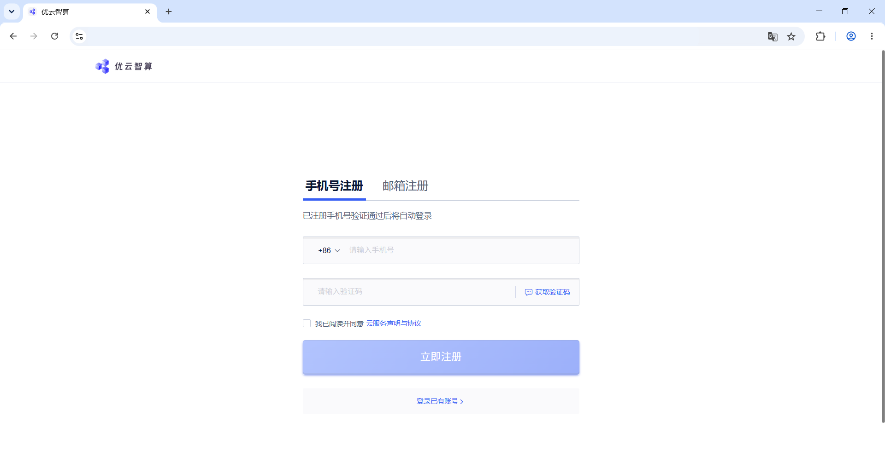

After registration, Compshare may show a bonus verification dialog. Choose the identity card that matches your usage. Individual users usually choose “个人开发者/研究员” or “个人爱好者”, then click “前往认证”.

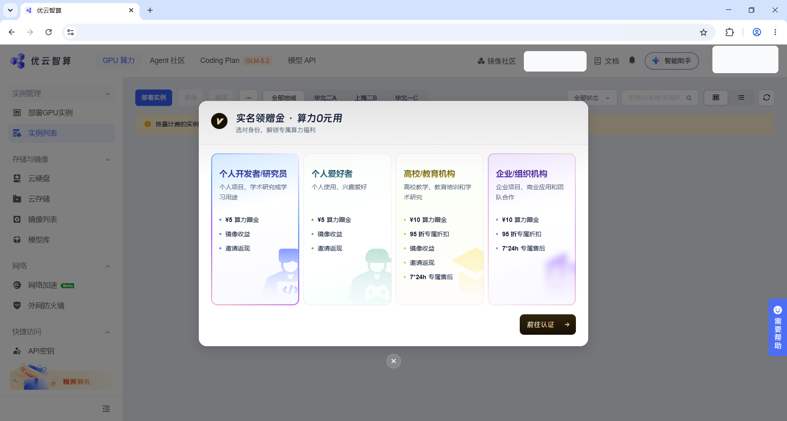

On the “实名认证” page, choose the matching verification type. Individual users click “立即认证” in the “个人认证” card. Education or organization users should click “立即认证” in the matching card.

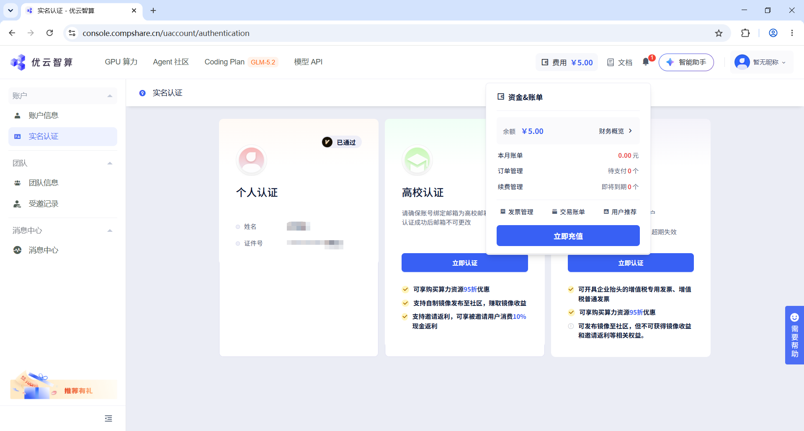

If the page shows QR verification, scan the QR code with your phone and finish the authorization steps there. The QR code in this screenshot is redacted; scan the QR code displayed on your own page.

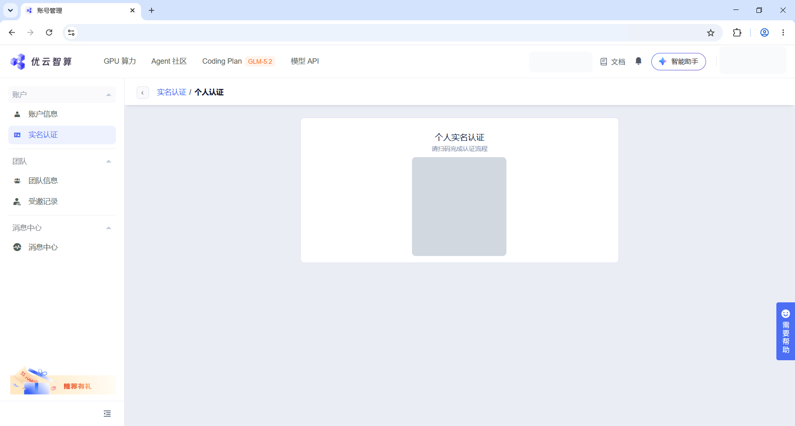

## 2. Create an Instance From the Image

Open the OpenTalking image page and confirm that the title is OpenTalking. In the action panel on the right, click “使用该镜像创建实例” to enter the instance deployment page.

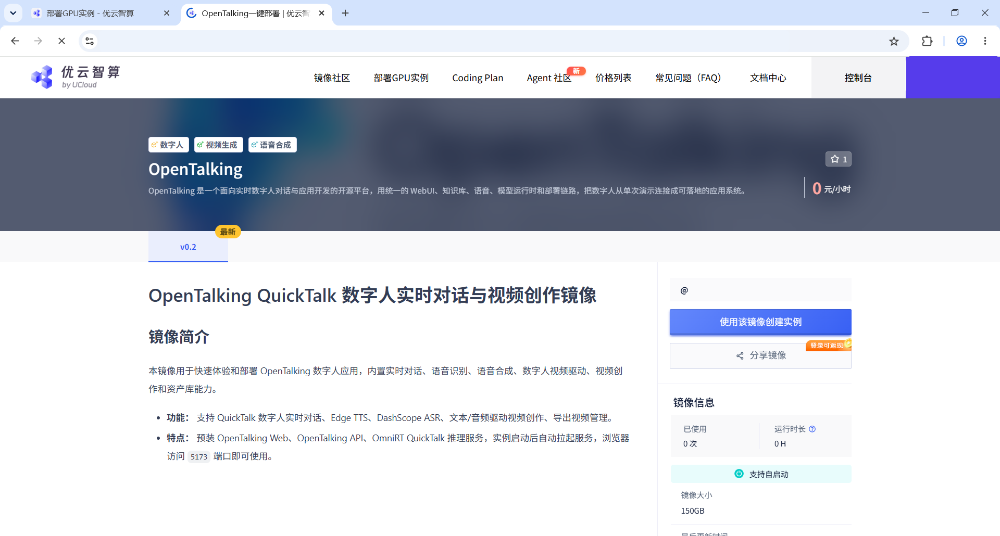

## 3. Choose the Instance Configuration

On the deployment page, choose a region first. Prefer a region with available resources. If a region or GPU type has no available capacity, switch to another region or GPU type.

In the “实例配置” section, confirm “实例类型”, “GPU 型号”, “GPU 数量”, and “CPU 配置”. For a quick trial, use a single-GPU instance and set the GPU count to 1.

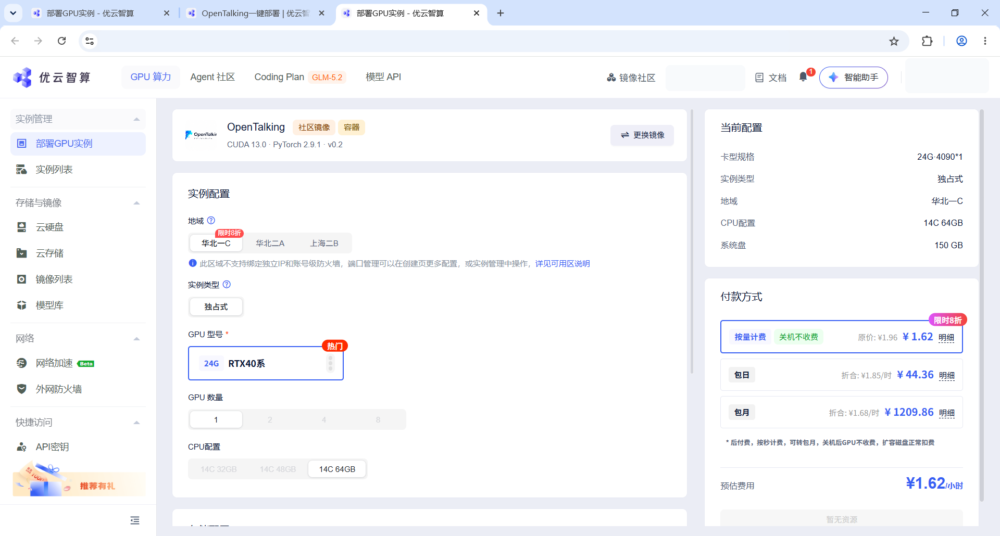

Scroll down and review the storage settings and the “当前配置” panel on the right. After confirming the configuration, choose a billing method under “付款方式”, then click “立即部署”.

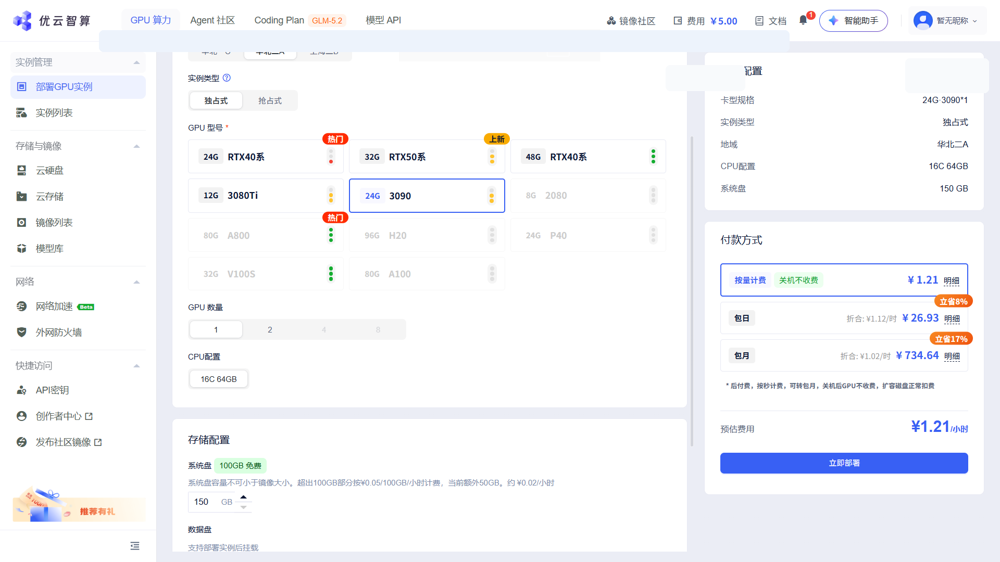

## 4. Wait Until the Instance Is Running

After submitting the deployment, return to “实例列表”. A newly created instance may show an initializing status. Wait for it to finish; if the list does not update, click the refresh button in the upper-right corner.

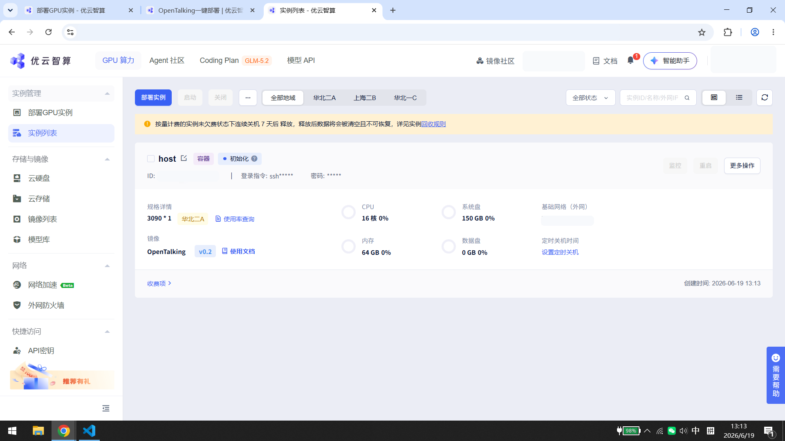

When the instance status becomes “运行中”, several action buttons appear on the right side of the instance card. To try OpenTalking, click “WebUI”. You can also see the “Omnirt-Quicktalk” button in the same row if you need to confirm the backend service entry.

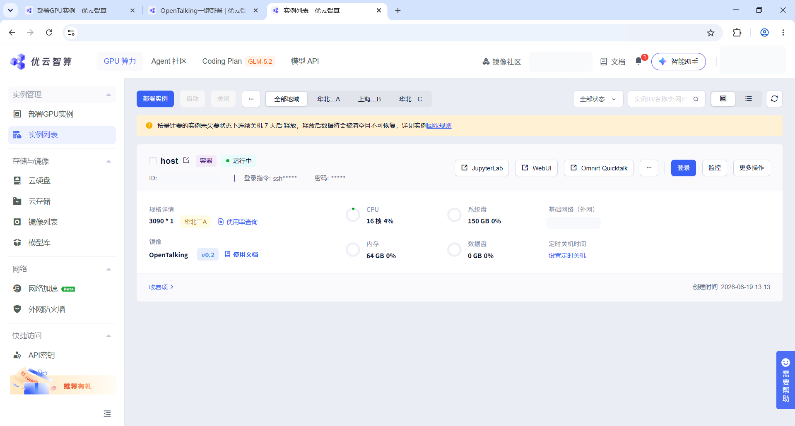

## 5. Open OpenTalking Studio

After clicking “WebUI”, the browser opens OpenTalking Studio. On first load, the page may show “未连接” or prepare assets. Wait until the top-right status changes to “已连接”.

In the left “静态配置” panel, confirm the speech and recognition service settings. If you need to use your own service credentials, enter them in the matching fields and click “应用配置”.

Choose a digital human in the center “形象库”. On the right, confirm that “已选驱动模型” is QuickTalk and the status is “已连接”, then click “开始对话”.

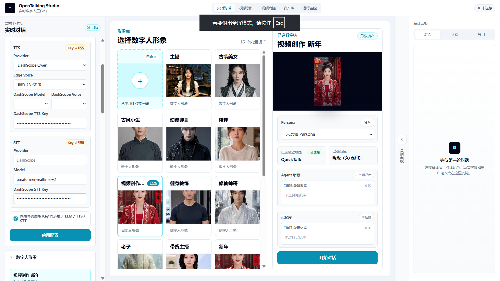

If the page says it is preparing the current digital-human asset, wait for it to finish. The first asset preparation creates a cache, so later use is usually faster.

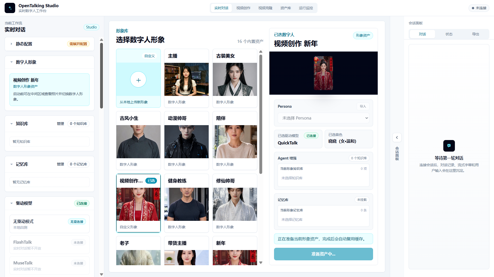

After the connection succeeds, type a sentence in the input box at the bottom and send it, or click the microphone button for voice input. The “会话面板” on the right shows the conversation, and the digital human plays the response in the main area.

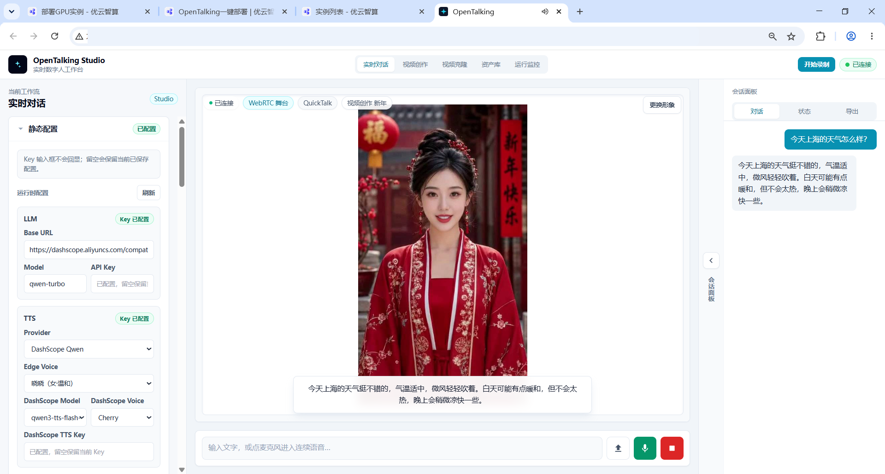

## 6. Try Video Creation and Voice Cloning

To create an offline talking-head video, click “视频创作” in the top navigation. Choose a source avatar on the left, select “离线数字人口播” in the center, choose QuickTalk, and keep the task type as “数字人口播视频”.

Under “音频来源”, choose “上传音频”, “文本合成”, or “复刻音色”. To try voice cloning, click “复刻音色”, enter the talking script, choose a voice, then click “录制/上传复刻”.

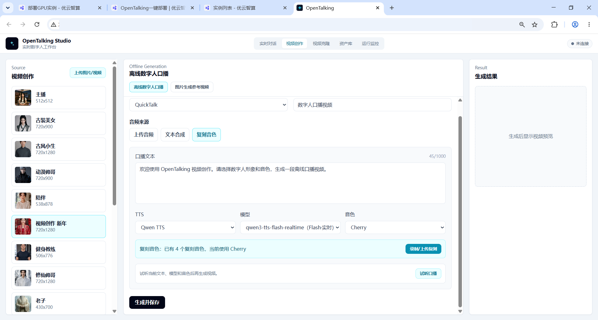

The “音色复刻” panel shows the text to read. Record or upload an audio file as prompted. After confirming that the audio can be played, click the submit button and wait for the cloning task to finish.

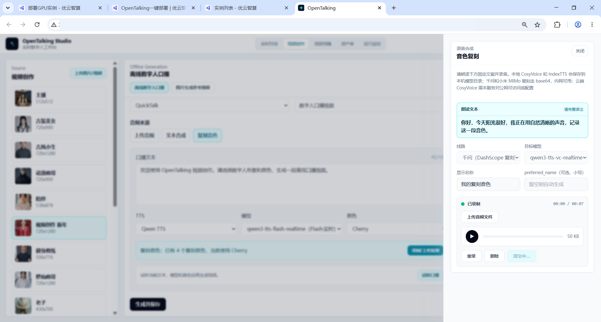

After voice cloning finishes, return to the video creation page. Click “试听口播” to preview the voice, or click “生成并保存”. When generation completes, the “生成结果” panel on the right shows a video preview and provides “下载” and “去资产库查看”.

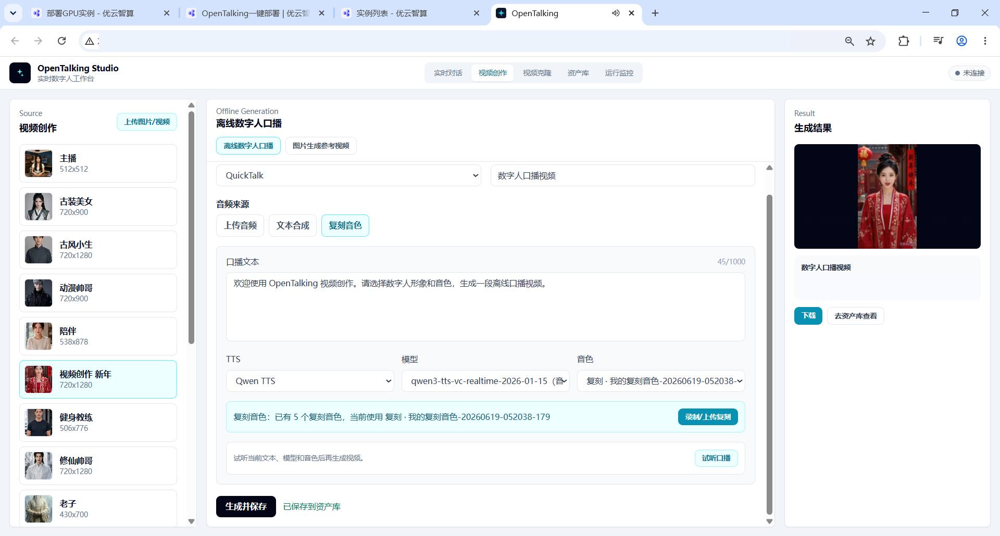

## 7. Common Situations

- The page is blank after clicking “WebUI”: wait for the instance self-start process to finish. First startup and first asset preparation both take some time.
- The top-right status shows “未连接”: wait briefly and refresh the page. If it still does not connect, return to the instance list and confirm that the instance status is “运行中”.
- You cannot find the entry: click “WebUI” on the right side of the instance card instead of using an old browser tab.
- Voice input is unavailable: the browser may restrict microphone permissions on public web pages. Use text input for the first trial.
- You want to start over: return to the instance list, click “更多操作” on the right side of the instance, and use the restart option provided by the platform.
